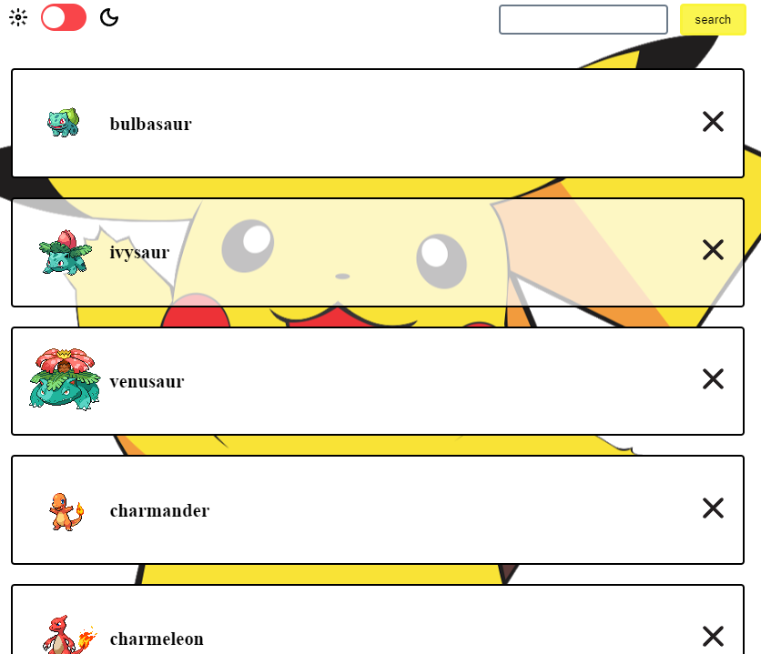

# pokemons-api

 Полноценное SPA приложение с использованием (PublicApi)[https://pokeapi.co/].

Это список покемонов с парочкой фич.

## Фичи

1. Возможность добавлять и удалять пакемонов из списка. Добавление осуществляется через поиск по api. В случае, если такой покемон существует в api и отсутствует в списке, он добавляется в начало списка. 
2. Темна и светлая тема.

## Значимость

В этом проекте изучала использование мемоизации в React (memo, useMemo, useCallback) и управление состоянием через useContext, Redux и LocalStorage.

## Картиночки

Dark:  
 
Light:  

## Примечание

Проект изначально разрабатывался на gitlab.